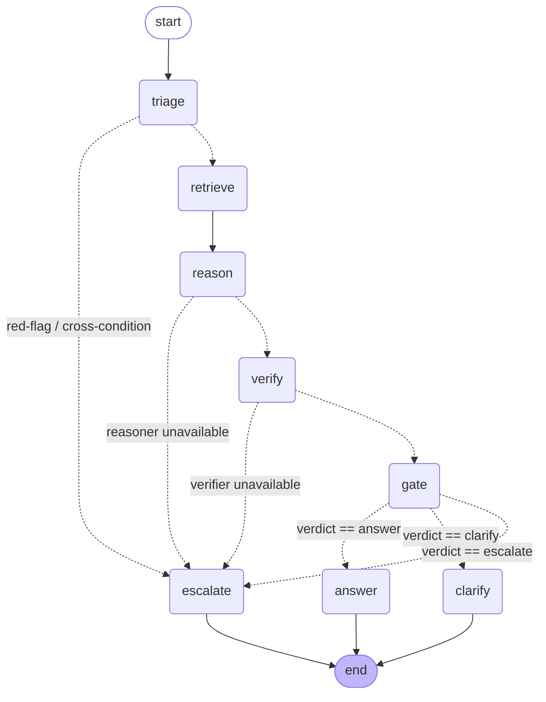

# CareLine — Orchestration Architecture (RU-6)

How a single patient question flows through the multi-agent spine, and why the
multi-node graph can never disagree with the verified decision core.

## The compiled LangGraph

The live call path is a compiled LangGraph `StateGraph` over one typed `GraphState`.
Solid edges are unconditional; dotted edges are the conditional routes (the required
branching point is the route on the verdict out of `gate`).

(The diagram is generated from the compiled graph itself — see
`CompiledBrainGraph.mermaid()`.)

## The agent nodes

| Node | Agent | What it does | Delegates to |
|---|---|---|---|
| `triage` | Triage | red-flag rail + multi-condition tripwire, **pre-LLM** | `domain/rails/red_flag.py` |
| `retrieve` | Retrieval (RAG) | currently-valid slice for this patient + `now` | `Patient.valid_slice` |
| `reason` | Reasoner | propose a grounded candidate (fail-closed) | `Reasoner` port |
| `verify` | Verifier | independently veto an unsupported candidate (lazy) | `Verifier` port |
| `gate` | Gatekeeper | 5-gate chain → final verdict | `domain/gates/chain.py` |
| `answer` / `clarify` / `escalate` | — | record the route and terminate | — |

## The safety invariant: Brain is the authority, the graph delegates

There are two ways to run a question:

- **Headless** — `Brain.run_question(...)` (`domain/brain/brain.py`).
- **Multi-agent** — the compiled graph (`adapters/orchestration/graph.py`).

Both run the **same** domain primitives in the same order: `check_red_flag` /
`check_multi_condition`, `Patient.valid_slice`, the injected `Reasoner` / `Verifier`
ports, and `run_gate_chain`. The graph adds explicit agent nodes and observability but
re-implements **no** safety logic.

This is enforced, not asserted: `tests/brain/test_parity.py` runs every route and
early-exit through **both** engines and requires the identical verdict (and answer
text / scope / citations). So adding the multi-agent presentation can never change a
safety decision — the property the whole design depends on.

## Composition

`build_default_graph()` assembles the graph from the adapter factory: keyless heuristic
twins by default (offline, no API key), or Anthropic / OpenAI via
`CARELINE_LLM_BACKEND`. That single call is the entry point the API wires into
`app.state`.

— Ruthwik (Orchestration Lead) · tasks RU-1…RU-6
