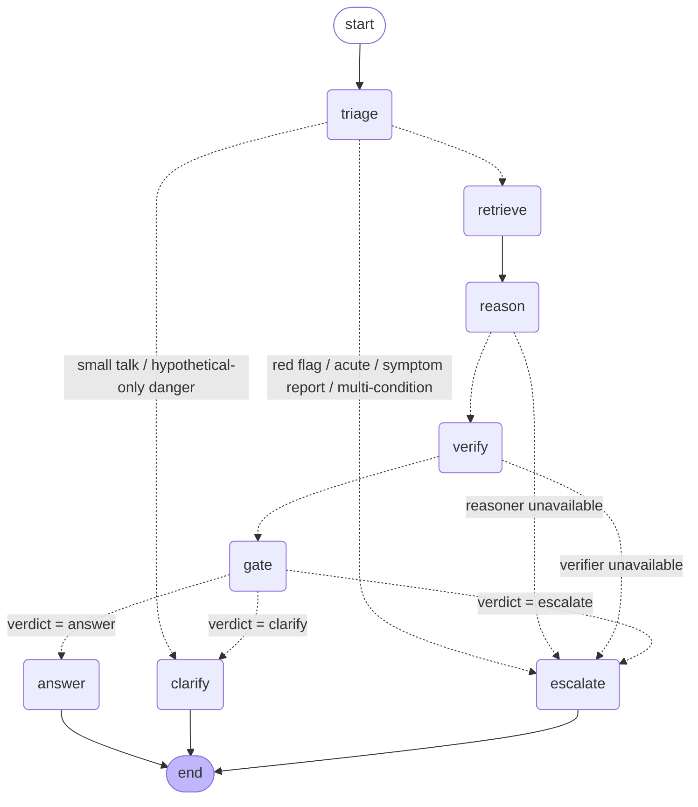

# CareLine architecture

How one patient question travels from the browser to a verdict, how each hop
talks to the next, and how a change to a prompt or safety policy reaches
production. The requirement ids (F*, N*) refer to the Requirements table in the
[README](../README.md#requirements).

## 1. End-to-end data flow (one question)

```
 Browser (Next.js web, patient portal / doctor console)
   │  ① HTTPS · REST · JSON body · Authorization: Bearer <JWT, role=patient|doctor>     [sync]
   ▼
 FastAPI (uvicorn, one process)
   │  middleware (outer → inner): ForwardedProto (scheme only, when proxy hops > 0) → CORS
   │                              → BudgetGuard (per-IP / login / daily caps, when configured)
   │  router: POST /patient/ask  ·  POST /internal/run-question (X-Internal-Key)  ·  POST /demo/ask (non-prod)
   │  ② Patient aggregate loaded: PatientRepository.get(doctor_id, patient_id)
   │     Mongo via motor (async) or in-memory  ·  Pydantic domain objects                [async, awaited]
   │  ③ run_in_threadpool(QuestionService.run_question)  ·  in-process Python call       [sync on a worker thread]
   ▼
 QuestionService  (session, audit, telephony, monitoring around the graph)
   │  ④ CompiledBrainGraph.run_question  ·  in-process  ·  typed GraphState               [sync]
   ▼
 ┌─ LangGraph StateGraph ─────────────────────────────────────────────────────────────┐
 │ triage    run_triage(): pre-LLM deterministic rails on the raw question            │
 │           hit → Decision(ESCALATE)  ·  small talk / hypothetical-only → CLARIFY    │
 │ retrieve  Patient.valid_slice(now): Layer-1 approved + currently valid facts only  │
 │           retrieve_relevant(): lexical ranker over that slice → grounding subset   │
 │ reason    Reasoner.propose(question, grounding) → ClassifierProposal (Pydantic)    │
 │ verify    Verifier.verify(question, proposal, FULL valid slice) → VerificationResult│
 │           ⑤ live: OpenAI Responses API, responses.parse + text_format (strict       │
 │             Pydantic schema), HTTPS/JSON, sync SDK call · keyless twins offline    │
 │           any SDK error / refusal → ReasonerUnavailable → ESCALATE                 │
 │ gate      run_gate_chain(): 5 gates, citation veto, answer-text grounding (v7),     │
 │           final danger / body-state invariant                                      │
 └─ answer | clarify | escalate (terminal nodes record the route) ────────────────────┘
   │  ⑥ Decision (Pydantic: verdict, answer_text, citations, confidence, risk, trace)
   ▼
 QuestionService, after the decision
   │  ⑦ ESCALATE → TelephonyPort.escalate(EscalationPayload)  ·  in-memory stub          [sync]
   │  ⑧ AuditService.log_turn → in-memory read model under a lock, then write-through
   │     to Mongo via pymongo replace_one; best effort (a storage error never fails
   │     the turn). A CLARIFY that names a danger concept or a present symptom is
   │     stored needs_review=True → doctor's review queue (GET /escalations → review)   [sync, same thread]
   │  ⑨ online_monitor.record(...) → bounded ring buffers; sampled ANSWER turns go on a
   │     bounded queue to a judge thread (LLM-as-judge or keyless twin)                  [async, background thread]
   │  ⑩ Langfuse record_turn (when keys + obs extra) → SDK batches and flushes on its
   │     own thread  ·  HTTPS/JSON  ·  patient id salted-hashed                          [async, background thread]
   │  usage_recorder: per-call tokens / latency / $ (+ JSONL if CARELINE_USAGE_LOG)     [sync, in-process]
   ▼
 FastAPI → PatientAnswerOut JSON {verdict, answer_text, escalation_reason, citations,
           patient_message, emergency}  (emergency=true → portal shows the 112 banner)   [sync response]
```

| Hop | From → to | Sync / async | Protocol | Data format |
|---|---|---|---|---|
| ① | Browser → FastAPI | sync request/response | HTTPS, REST | JSON; JWT bearer (HS256, `role` claim) |
| ② | Router → PatientRepository | async (awaited) | motor → MongoDB wire protocol, or in-memory | BSON → Pydantic `Patient` |
| ③ | Router → QuestionService | sync on the threadpool | in-process call | Python objects |
| ④ | QuestionService → graph | sync | in-process | `GraphState` (TypedDict) |
| ⑤ | reason / verify → OpenAI | sync | HTTPS, OpenAI Responses API | JSON, structured output parsed into Pydantic DTOs |
| ⑥ | gate → QuestionService | sync | in-process | `Decision` (Pydantic, frozen) |
| ⑦ | QuestionService → telephony | sync | in-process port (stub) | `EscalationPayload` (Pydantic) |
| ⑧ | AuditService → Mongo | sync, best effort | pymongo | BSON documents keyed by `(doctor_id, patient_id)` |
| ⑨ | QuestionService → monitor → judge | enqueue sync; judge async on a thread | in-process; judge → OpenAI HTTPS | aggregate features only (no question text kept) |
| ⑩ | tracer → Langfuse | async (SDK background flush) | HTTPS | JSON events |

Design notes:

- **Why sync plus a threadpool.** The domain spine is pure synchronous Python, and
  the LLM SDK calls block. Every question route therefore hands the pipeline to
  Starlette's threadpool, so one slow model call never stalls the event loop or
  `/health`. That is enough for N5 at one process. An async LLM client would
  matter only past the threadpool size (40 threads by default).
- **One process.** The rate limiter, login lockout, online monitor and usage
  buffer are in memory and per process. Running more than one replica needs a
  shared store, which is noted as a scaling limit.
- **Extraction is a separate path.** The extraction pipeline runs consultation
  transcript → `POST /consultations/{id}/extract` (LLM extractor or regex twin) →
  doctor approval → `apply_facts` on Layer 1 plus `MemoryProvider.index`. It
  writes the facts that the question path later reads. It is not a graph node.

## 2. The compiled graph

This matches `build_default_graph().mermaid()` at this commit. The edge labels
were added by hand to show the reason for each conditional route.


```mermaid
graph TD;
    __start__([start]):::first
    triage(triage)
    retrieve(retrieve)
    reason(reason)
    verify(verify)
    gate(gate)
    answer(answer)
    clarify(clarify)
    escalate(escalate)
    __end__([end]):::last
    __start__ --> triage;
    triage -.->|red flag / acute / symptom report / multi-condition| escalate;
    triage -.->|small talk / hypothetical-only danger| clarify;
    triage -.-> retrieve;
    retrieve --> reason;
    reason -.->|reasoner unavailable| escalate;
    reason -.-> verify;
    verify -.->|verifier unavailable| escalate;
    verify -.-> gate;
    gate -.->|verdict = answer| answer;
    gate -.->|verdict = clarify| clarify;
    gate -.->|verdict = escalate| escalate;
    answer --> __end__;
    clarify --> __end__;
    escalate --> __end__;
    classDef first fill-opacity:0
    classDef last fill:#bfb6fc
```

| Node | What it does | Code |
|---|---|---|
| `triage` | Pre-LLM rails on every question, in this order: red-flag rail (literal + structural + lexical paraphrase, Hinglish, typo normalisation, since v6 de-obfuscation of spaced, hyphenated and leetspeak words plus generic distress phrases, since v7 dropped-g / apostrophe-less repair ("havin fits", "Ive") plus the final red-team families, and since v8 suicide planning / farewell behaviour, child ingestion and "N of them" ingestion counts) → acute-concern net → structural symptom-report layer → multi-condition tripwire → hypothetical-only danger (CLARIFY with the 112 line) → small talk. Every red-flag and multi-condition escalation text ends with the 112 line | `domain/brain/triage.py::run_triage`, `domain/rails/*` |
| `retrieve` | Layer-1 valid slice at `now`, then a lexical relevance ranker that narrows the reasoner's grounding. The gate and verifier still see the full slice | `Patient.valid_slice`, `domain/retrieval/ranker.py` |
| `reason` | Proposes a scope, an answer and citations; fails closed | `Reasoner` port (`adapters/llm/openai_backend.py`, `anthropic_backend.py`, `heuristic.py`) |
| `verify` | Independent veto against the full valid slice. Runs only when the proposal is answerable | `Verifier` port |
| `gate` | Five gates (scope, which re-checks every emergency net for every scope; risk; cross-condition; confidence/staleness; independent verification). Gates only downgrade. Then, before any ANSWER, three deterministic final invariants: a **citation veto** (v6: any cited id that is not an exact id in the valid slice, or a duplicate, gives CLARIFY); an **answer-text grounding check** (v7, hardened in v8: every dose / strength / frequency / number token and every drug name in the answer text must appear in a CITED fact of the current valid slice — units, spacing, case, compound number words and frequency words normalised, mass and volume compared by value (1 g = 1000 mg), dose-change words such as "double" or "half" must be in a cited fact, about 120 brand names mapped to generics, any word next to a dose treated as a drug claim, and a take/stop polarity check against the cited facts — so a superseded dose behind a current fact's id, or a reversed instruction, gives CLARIFY); and a re-scan of the question with all context guards off, so no question containing a danger concept or (v6) a present body-state report ends in ANSWER. The veto and grounding check ESCALATE instead of clarifying when a danger concept is present or the clarify budget is spent | `domain/gates/chain.py::run_gate_chain`, `domain/gates/grounding.py` | `domain/gates/chain.py::run_gate_chain` |
| `answer` / `clarify` / `escalate` | Record the route and terminate. The escalation handoff itself runs in `QuestionService`, not in the node | `adapters/orchestration/graph.py` |

**"Seven roles", stated precisely.** The graph has **5 agent nodes** (triage,
retrieve, reason, verify, gate) and **3 terminal nodes**. The escalation handoff
is a service step (`QuestionService._deliver_escalation` → `TelephonyPort`).
Extraction is a service (`ExtractionService`), not a graph node. Counting those
two gives the seven roles named elsewhere. Only reason, verify, extraction and
the online judge call an LLM, and each has a keyless twin.

## 3. Brain and graph: one safety authority

There are two engines. One is the headless `Brain.run_question`
(`domain/brain/brain.py`), which the eval gate scores. The other is the compiled
graph, which production serves through `QuestionService(graph=...)`. The graph
does **not** call the Brain. It calls the same domain primitives in the same
order. Two of those are literally shared functions: `run_triage` and
`run_gate_chain`. The others (`valid_slice`, `retrieve_relevant`, the
Reasoner/Verifier ports) are called identically.

Because the gate scores the Brain and users are served by the graph, parity is
what makes the gate's numbers apply to production:

- `tests/brain/test_parity.py` and `test_parity_question_service.py` cover every
  route and early exit, including narrowing. Brain ≡ graph ≡ service.
- The adversarial-review and blind-battery tests (`test_review_round2.py`,
  `test_blind1_battery.py`) assert Brain/graph parity on every probe.
- `test_review_round4.py` (v6) asserts Brain/graph parity for the citation
  veto (superseded, case-mangled, duplicate, unknown and whitespace-mangled ids)
  and for the mixed-emergency template.
- `test_answer_grounding.py` (v7) asserts Brain/graph parity for the
  answer-text grounding check (superseded dose behind a current id, a reused
  id, retired / not-yet-valid / uncited drugs and doses, faithful paraphrases),
  and `test_final_redteam_v7.py` for the final red-team emergencies.
- `test_grounding_v8.py` and `test_final_eval_v8.py` (v8) assert Brain/graph
  parity for the 13 grounding bypasses, the legitimate paraphrases that must
  still ANSWER, and the final evaluator's emergency families.
- A one-off check over the 339 items of the v5 eval set (it is not a committed
  test) found 0 differences in verdict, citations or answer text. On battery 3
  with a worst-case stand-in reasoner, Brain and graph also agreed on every item.

One known gap is configuration rather than code. The gate runs with a clarify
budget of 2, while the web routes (`/patient/ask`, `/demo/ask`) use 0: a one-shot
web turn goes to the doctor instead of asking the patient to rephrase. At budget
0, 4 of 65 out-of-scope items escalate instead of redirecting (redirect accuracy
0.938, still ≥ 0.90). The deviation is in the safe direction, and we disclose it
instead of hiding it.

## 4. Two-layer data, stated honestly

- **Layer 1 (source of truth)** is MongoDB through motor, or in memory. Every fact
  has a half-open validity window (`effective_from <= now < superseded_at`) and a
  doctor-approval stamp. Every repository read is keyword-scoped by
  `(doctor_id, patient_id)`, and there is no cross-patient read path (F4).
  Superseded facts are structurally absent from `valid_slice` (F5).
- **Layer 2 (`MemoryProvider`)** is written on approval (`index`) and erased on
  DPDP deletion (`forget`). **It is not read on the decision path.** The
  `retrieve` node ranks the Layer-1 valid slice directly. The idea that "memory
  proposes, source of truth disposes" describes the designed seam. Today the
  disposal side is the whole path. We kept it that way because per-patient
  records are small and the decision path is synchronous; a vector lookup would
  add latency and a second source of truth without improving groundedness.

## 5. Release pipeline

```
 developer branch
   │  test-first commit (failing probes)  →  rail change + policies/red-flags.vN.yaml
   │  + manifest.yaml re-hash + changelog  →  gate report after-policy-vN.{json,md}
   ▼
 Pull request ──► GitHub Actions (ci.yml)
                    ├─ Suite (keyless)               pytest, no secrets
                    ├─ Eval gate (deterministic)     391 items; 8 absolute gates; per-case regression
                    │                                vs after-policy-v8.json on shared ids; split
                    │                                floors; fails → red check (does not block yet)
                    └─ LLM slice (optional)          push / dispatch only; gpt-4o-mini + judge;
                                                     no key secret → exit 2 → job exits 0: the check
                                                     shows GREEN, with SKIPPED in the job summary and
                                                     a warning annotation (it has never run in CI)
   ▼
 push to main ──► Render blueprint (autoDeploy: true) builds backend/Dockerfile → /health check → live
                  (runs in parallel with CI; a red check does not stop it)
   ▼
 rollback: Render "Rollback" to the previous deploy (immediate)  ·  git revert <release commits> → CI → redeploy
```

Gaps we disclose:

- **Deploy happens on push to `main`.** Render's `autoDeploy: true` does not
  wait for CI, and `main` has no branch protection, so a red check stops neither
  the merge nor the deploy. Pending team actions: `autoDeployTrigger:
  checksPass` (Render's "deploy after checks pass") plus branch protection
  requiring the two CI checks.
- Release tags `baseline-v0` and `release/red-flags-v2` … `-v8` exist. `-v6`
  and `-v7` point to the same commit (`1aed531`): those two releases landed
  together, so the durable rollback from v7 goes to v5, not v6 (README,
  Rollout and rollback).
- The YAML policy files mirror the code constants (a test enforces this), but
  they are not loaded at runtime. Rolling back means reverting the release
  commit, not editing the manifest pin.

## 6. Components and why

| Component | Choice | Requirement it serves | Why this and not the alternative |
|---|---|---|---|
| Pre-LLM rails | Deterministic regex, structural and lexical-paraphrase rules | F2, F3, N3, N6 | An emergency is caught before any model call, so it costs $0 and adds no model latency, and CI can measure it without a key. The limit (blind recall 88% at v6 and v7, 90% at v8, battery 3) is disclosed |
| Gate chain | Citation veto, 5 ordered gates that only downgrade, and a final danger + body-state invariant | F3, F5, F6, N8 | The model proposes and never routes. Every route is reviewable code that the gate can test |
| Orchestration | LangGraph `StateGraph` | observability | Explicit agent nodes and per-node traces. Parity tests keep it equal to the Brain |
| Reasoner + separate Verifier | Two structured LLM calls | F6 (no ungrounded answers) | An independent veto against the full slice catches answers the reasoner over-reached on. It costs about +50% $ per answered request (estimate $0.000101 per verifier call) and a second sequential round trip: on the one live run, model-handled questions took 1.3–3.6 s end to end and p95/max 3.6 s misses the 3 s target |
| Model | gpt-4o-mini (claude-haiku-4-5 as the alternative) | N6, N7 | Budget-first. Answers are short and grounded, and the gate never trusts the model's routing |
| Structured outputs | Responses API `responses.parse` with Pydantic `text_format` | F1 | Every handoff is a validated object, never free text. Any parse failure fails closed |
| Layer-1 store | MongoDB (motor) with temporal validity and approval stamps | F4, F5 | Validity is a property of the data, not of retrieval scoring |
| API | FastAPI with the sync pipeline on the threadpool | N5 | Typed DTOs, and a slow LLM call never blocks the event loop |
| Auth | Per-doctor pbkdf2 hashes; patient `{doctor_id, patient_id, pin}`; JWT `role` claim; login lockout | F4 | Fixes the review findings: password-less doctor tokens, cross-tenant portal login, PIN brute force |
| Budget guard | Per-IP minute windows (spend and login separate), daily cap, rightmost-XFF client IP | N7 | Spend is capped by configuration, and a spoofed XFF cannot dodge the limit |
| Eval gate | Keyless deterministic slice in CI | F2–F8, N1 | No secrets, so fork PRs are gated. Reproducible, and the 391 items run in about 1.7 s |
| LLM slice | Live model + LLM-as-judge with an sqlite response cache | N2 | Measures what the keyless twin cannot (answer accuracy, faithfulness). The full 391-item slice has not been run; one live end-to-end flow check (18 questions, judge 6/6 faithful) has |
| Online monitor | In-process ring buffers and a sampled judge thread | N1, N4, N6 | Five monitoring categories with no extra infrastructure on a free tier. Per-process only |
| Tracing | Langfuse (optional `obs` extra) | N4, N6 | Per-turn cost and latency traces. No project is configured yet |
| Deploy | Render Docker blueprint, free tier | live URL | One file and fictional data. Not deployed yet |

## 7. Failure behaviour (fail closed)

| Failure | Behaviour |
|---|---|
| Reasoner or verifier unavailable (no SDK, API error, refusal, parse failure, timeout) | `ReasonerUnavailable` → ESCALATE, counted as fail-closed in `/monitoring`. Every client has a 20 s timeout and one retry (`openai_client_kwargs`), so a hung provider fails closed in ≤ ~40 s |
| Cited fact id not in the valid slice (superseded, other patient, mangled, duplicate) | Citation veto → CLARIFY, or ESCALATE with a danger concept or a spent clarify budget (v6) |
| Answer text carries a dose, number or drug name that is in no cited current fact (e.g. a superseded dose behind the current fact's id, a retired or not-yet-valid drug) | Answer-text grounding check → CLARIFY, or ESCALATE with a danger concept or a spent clarify budget (v7; v8 adds number words, unit values, dose-change words, brands and take/stop polarity). Still lexical: a paraphrase that changes kind ("14 days" for "two weeks") CLARIFIES; a wrong claim with no number, drug, dose-change or take/stop word is still the verifier's job |
| Rail misses an emergency | CLARIFY redirect ending with the 112 line; if the question names a danger concept or a present symptom, the turn is also flagged `needs_review` for the doctor's review queue (no page) |
| Unexpected exception in the pipeline | the error is counted in the monitor and traced, the exception propagates (HTTP 500 with no traceback in the body), and the patient is not answered |
| Mongo audit write fails | the turn still returns (audit is best effort); the in-memory read model keeps the record |
| Judge queue full or judge error | the sample is dropped and counted, never scored as faithful |
| Dev-default secrets in production or public-demo mode | the app refuses to start |
| Manifest hash mismatch | the registry fails closed and the gate does not run |
